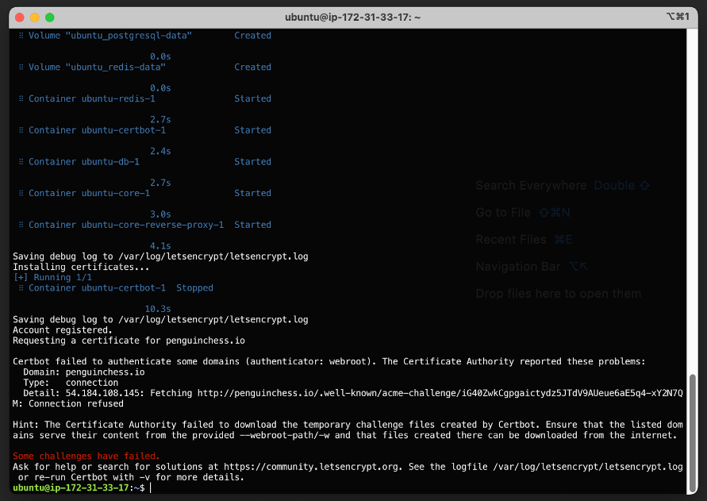

===========================
Core Deployment Guide (AWS)
===========================

Key Pair
++++++++

#. Make sure these are set for ``~/.ssh/config``::

    Host *
    UseKeychain yes

#. Create new keypair via AWS UI::

    # update permissions to be read only
    chmod 400 ~/Downloads/Bucky-iMac.pem

    # add the key to your agent
    ssh-add -K ~/Downloads/Bucky-iMac.pem

Create EC2 instance
+++++++++++++++++++

Create an EC2 instance::

    t2.micro
    Ubuntu 20.04 64-bit (x86)
    security group settings

Install Docker
++++++++++++++
To install Docker (known working version 20.10.14, build a224086) on target machine follow the instructions below
(based on https://docs.docker.com/engine/install/ubuntu/ )

Login to the EC2 instance
-------------------------

Login to the EC2 instance::

    # TODO(dmu) HIGH: It is better to configure DNS names first, so we can you domain name instead of IP-address
    # IP_ADDRESS is the IP-address
    ssh ubuntu@IP_ADDRESS

Uninstall any existing versions of Docker
-----------------------------------------

It's OK if apt reports that none of these packages are installed::

    sudo apt remove docker docker-engine docker.io containerd runc

Set up the repository
---------------------

Before you install Docker Engine for the first time on a new host machine,
you need to set up the Docker repository. Afterward, you can install and update Docker from the repository::

    # update the package cache and upgrade packages
    sudo apt -y update && sudo apt -y upgrade

    # install packages to allow apt to use a repository over HTTPS
    sudo apt -y install ca-certificates curl gnupg lsb-release

    # add Dockers official GPG key
    sudo mkdir -p /etc/apt/keyrings
    curl -fsSL https://download.docker.com/linux/ubuntu/gpg | sudo gpg --dearmor -o /etc/apt/keyrings/docker.gpg

    # use the following command to set up the repository
    echo \
      "deb [arch=$(dpkg --print-architecture) signed-by=/etc/apt/keyrings/docker.gpg] https://download.docker.com/linux/ubuntu \
      $(lsb_release -cs) stable" | sudo tee /etc/apt/sources.list.d/docker.list > /dev/null

Install Docker Engine
---------------------

#. Install Docker Engine::

    # update the apt package index, and install the latest version of Docker Engine, containerd, and Docker Compose
    sudo apt -y update
    sudo apt -y install docker-ce docker-ce-cli containerd.io docker-compose-plugin

    # verify that Docker Engine is installed correctly by running the hello-world image
    sudo service docker start
    sudo docker run hello-world

#. Add your user to docker group

   Docker Engine is installed and running. The docker group is created but no users are added to it::

    sudo usermod -aG docker $USER
    exit

#. Pull the images::

    docker pull thenewboston/core
    docker pull thenewboston/core-reverse-proxy

Install Docker Compose
----------------------

Install Docker Compose (known working version v2.4.1) on target machine
according to https://docs.docker.com/compose/install/

Setup domain
++++++++++++

Domain Name
-----------

#. Navigate to EC2 > Network and Security > Elastic IPs
#. Click the "Allocate Elastic IP address" button
#. Click the Allocate button
#. Give that Elastic IP a more memorable name
#. Select it and choose click on “Associate Elastic IP address”
#. Associate it with your core instance
#. Check “Allow this Elastic IP address to be reassociated”
#. Click on “Associate”
#. Test by SSHing into the instance using the new IP.

Update your domain's DNS records to point to your elastic IP
------------------------------------------------------------

#. Create type A DNS record for your domain, which points to your elastic IP
#. Test by SSHing into the instance using the domain name

TODO:
SSL
redirect http to https, no-www to www

Install Core
++++++++++++

Run the deployment script::

    bash <(wget -qO- https://raw.githubusercontent.com/thenewboston-developers/Core/master/scripts/deploy.sh)

Here is the text::

    Saving debug log to /var/log/letsencrypt/letsencrypt.log
    Installing certificates...
    [+] Running 1/1
     ⠿ Container ubuntu-certbot-1  Stopped                                                                                                                                                                                                                                                 10.3s
    Saving debug log to /var/log/letsencrypt/letsencrypt.log
    Account registered.
    Requesting a certificate for penguinchess.io

    Certbot failed to authenticate some domains (authenticator: webroot). The Certificate Authority reported these problems:
      Domain: penguinchess.io
      Type:   connection
      Detail: 54.184.108.145: Fetching http://penguinchess.io/.well-known/acme-challenge/iG40ZwkCgpgaictydz5JTdV9AUeue6aE5q4-xY2N7QM: Connection refused

    Hint: The Certificate Authority failed to download the temporary challenge files created by Certbot. Ensure that the listed domains serve their content from the provided --webroot-path/-w and that files created there can be downloaded from the internet.

    Some challenges have failed.
    Ask for help or search for solutions at https://community.letsencrypt.org. See the logfile /var/log/letsencrypt/letsencrypt.log or re-run Certbot with -v for more details.

Create superuser
++++++++++++++++

Optionally create superuser::

    docker compose exec -it core poetry run python -m core.manage createsuperuser

This is a technical last line to serve as `end-of-file-fixer` workaround.
